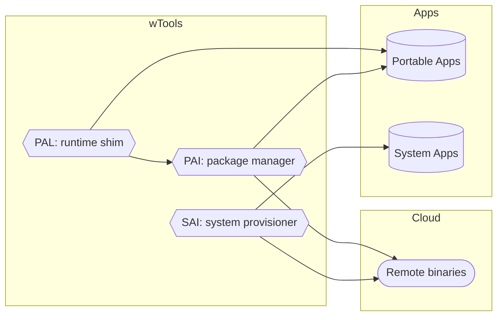
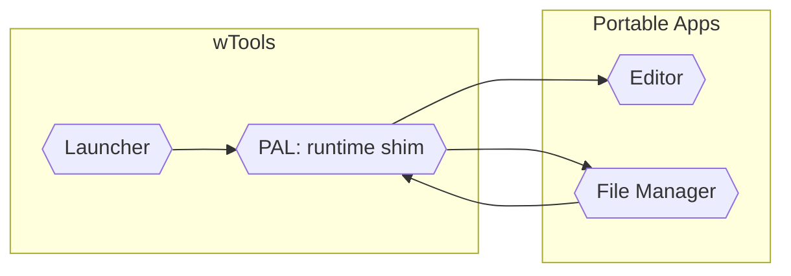
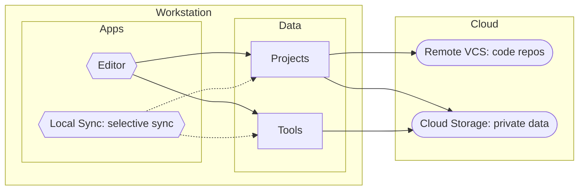

# wTools

2015. wTools is an INI-driven Windows application manager, written in NSIS 2, designed for automating system provisioning, tool deployment, and building reproducible development environments. For preparing Windows see [Windows Provisioning Toolkit](https://github.com/konskarz/wpt).

## Getting Started

- Download wTools from the [releases page](https://github.com/konskarz/wtools/releases).
- Run any executable. On first launch, it automatically generates an INI file in the same folder. Each INI contains inline documentation describing all properties and options.
- Edit the INI to configure applications to install or launch, define download URLs or offline sources, adjust paths, environment variables, and runtime behavior.
- Use anywhere. Each tool is fully self-contained – just the executable and its INI.

## Features

### Shared

- Support basic command-line options for controlling installer/launcher behavior.
- Recognize system and wTools-specific environment variables for portable paths and commands.
- Can run silently or interactively.
- NSIS-based interface for app lists and live logging.

### Installers

- Installs applications, skipping any already installed.
- Can fetch sources from URLs or use pre-downloaded offline files.
- Can update existing source files, skipping any that are missing, does not track versions automatically
- Handles archive extraction, directory renaming, and multi-step execution pipelines for general-purpose automation.
- Support batch processing via INI sections.
- Support multi-select app lists.

### SAI

- Installs system-level applications (requires admin).
- Can create desktop shortcuts and suggest reboot.

### PAI

- Installs portable applications (no admin required).
- Can update program directories/files, skipping any that are not installed.

### PAL

- Launches portable applications (no admin required).
- Launches one application per execution.
- Can fallback to installer if the executable is missing.
- Supports passing command-line arguments to launched applications, environment variable modification, and path adjustments.
- Can monitor and restore local files, directories, and registry keys.
- Can apply program settings and use a temporary directory.
- Supports semi-portable mode: applies settings only if missing and skips local state monitoring/restoration.
- Supports pre- and post-execution hooks.

## Interface

While wTools is designed to run silently for automated provisioning and deployment, each tool also provides a simple NSIS-based interface for interactive use and live logging, which can help troubleshoot INI configuration or app behavior. Selection: PAI and SAI allow multi-select, PAL – single-select.

### Components

```
+--------------------------------------------------+
| Portable/System Applications Launcher/Installer  |
+--------------------------------------------------+
| C:\Path\To\Tools                                 |
+--------------------------------------------------+
|                     +--------------------------+ |
| Applications:       | [ ] Git                  | |
|                     | [x] 7-Zip                | |
|                     | [ ] Node.js              | |
|                     | [ ] Visual Studio Code   | |
|                     +--------------------------+ |
+--------------------------------------------------+
| [Cancel]                               [Install] |
+--------------------------------------------------+
```

### Finish

```
+--------------------------------------------------+
| Portable/System Applications Launcher/Installer  |
+--------------------------------------------------+
| Execute: "C:\Path\To\Tool\executable.exe ..."    |
+--------------------------------------------------+
| [########----]                                   |
+--------------------------------------------------+
| Installing 7-Zip...                              |
| Download complete                                |
| Extracting files...                              |
| Installation complete                            |
+--------------------------------------------------+
| [Cancel]                                 [Close] |
+--------------------------------------------------+
```

## Workflows

### Provisioning



- PAL launches portable applications. If the executable is missing, PAL triggers PAI to install it.
- PAI manages portable applications, installing or updating them from available sources (local or remote).
- SAI provisions system-level applications that require admin permissions, using available sources (local or remote).

### Integration



- Launcher triggers PAL, which acts as a runtime shim to launch portable applications.
- PAL can open a file selected in File Manager in the Editor.
- File Manager can pass file paths back to PAL for processing or launching associated applications.

### Workspace



- Projects are stored locally and version-controlled via Remote VCS.
- Local Sync coordinates local directories and Cloud Storage.
- Editor accesses Projects and the wTools folder for editing and running applications.

> For guidance on data management in line with wTools, see the [Personal Computing Method](pcm.md).

## Advantages

- Quickly reproduce complete development environments on Windows.
- Create portable, isolated setups for testing or work.
- Automate repetitive installation and update workflows.
- Serve as a reference for designing reproducible provisioning and deployment workflows.

## History

- Developed between 2010–2015.
- Inspired by [portableapps.com](https://portableapps.com/) (first release 2004).
- Predates [WinGet](https://github.com/microsoft/winget-cli) (first release 2020).
