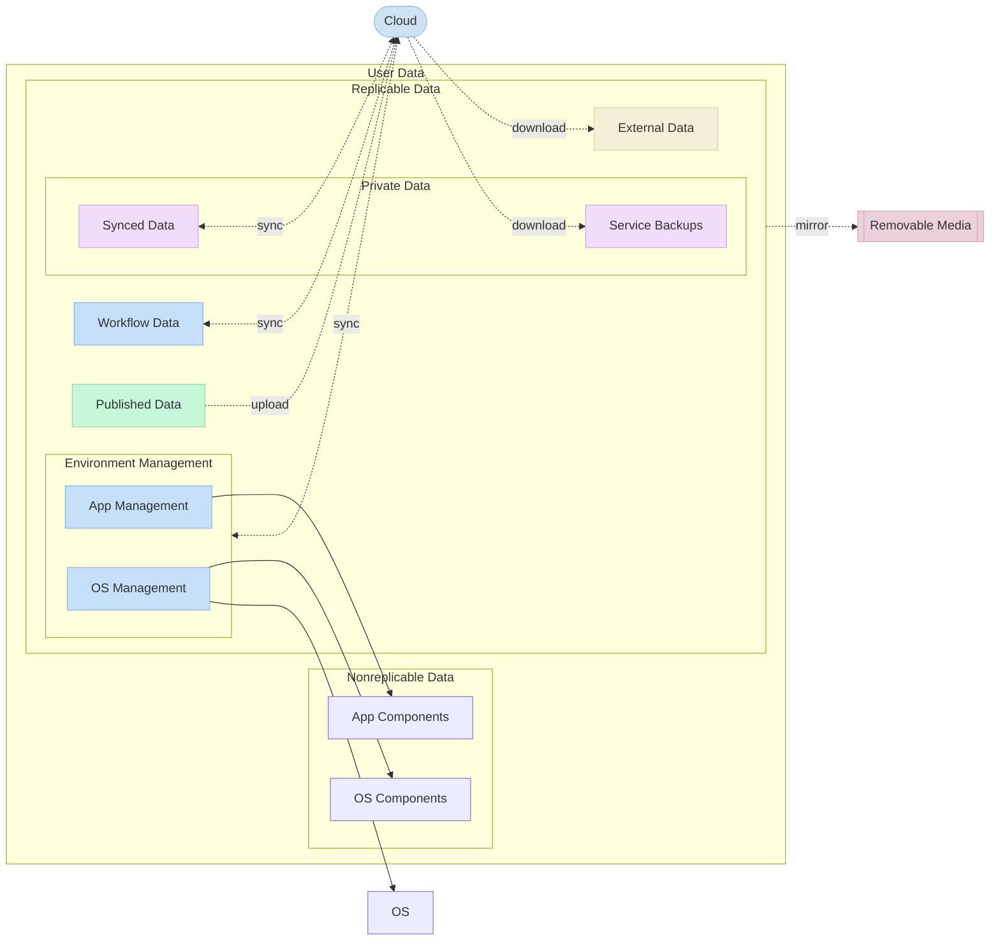

# Personal Computing Method

> Organize and manage digital work and tools in a way that separates concerns, controls replication, and supports reproducibility, to maintain control over data and workflows, reduce risk of data loss, and ensure consistent environments across devices.

- **Removable Media**: External storage (e.g., SD-card, phone storage) for local replication to ensure availability offline across devices
- **Cloud**: Cloud Libraries, Services, Storage, Version Control Systems for data consumption, publication and synchronization across devices, use online sync only for actively edited data
- **User Data**: separate OS and user data to reduce risk of data loss
- **Replicable Data**: separate data that should be replicated locally to reduce risk of loss and ensure availability offline across devices
- **Nonreplicable Data**: separate data that doesn’t need replication to optimize storage usage
- **App Components**: portable apps, packages
- **OS Components**: OS images, drivers, updates
- **App Management**: separate app management, used for portability, automation, and workspace integration to enable reproducible workflows across devices, and synchronize it via services to keep it editable across devices
- **OS Management**: separate OS management, used for setup, recovery, and post-install tasks automation, to maintain stable environments, and synchronize it via services to keep configurations consistent across devices
- **Workflow Data**: separate workflow data, synchronized via services to keep it editable across devices
- **Published Data**: separate data intended for publication
- **Private Data**: separate personal data from workflow data to maintain control and privacy
- **Service Backups**: backup personal data from external services to reduce risk of loss
- **Synced Data**: separate personal data synchronized via services to keep it editable across devices
- **External Data**: separate data for consumption, created by others, to avoid mixing with personal workflows and ensure availability offline across devices
